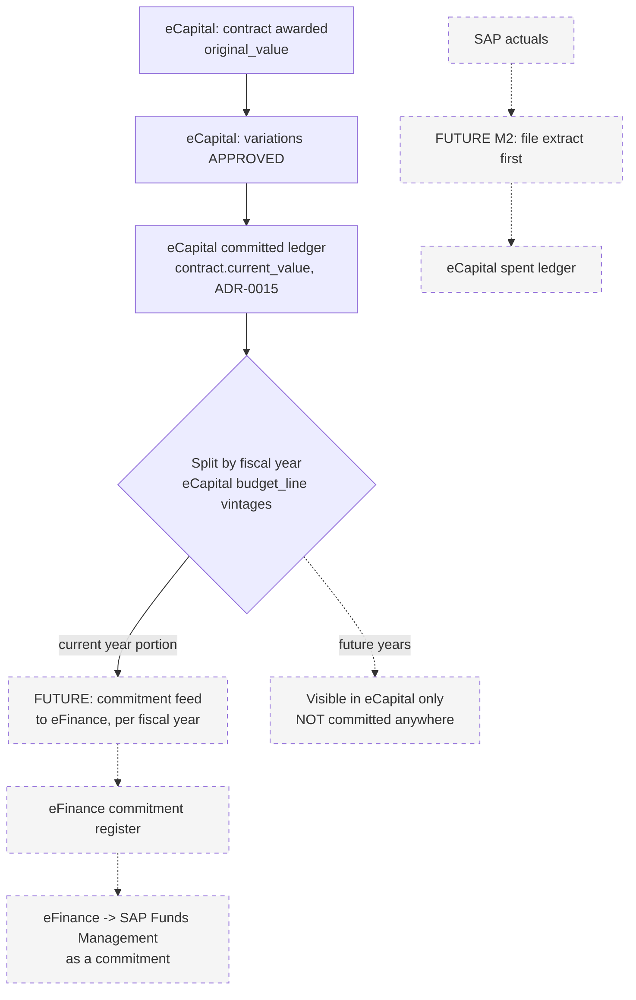

# eFinance, eMAP, eCapital: how the three systems fit together

**For:** whoever builds or operates any of the three (human or agent)
**From:** the eCapital deployment work, `/opt/ecapital` on `10.227.56.22`
**Language note:** English, because this is a technical spec, in the same
register as eFinance's own `INTEGRATION-eMAP.md`, which this document
follows as its model. Each application's own UI stays in its own language —
eFinance and eMAP in Greek, eCapital in Greek first and English second.

---

## 1. What each system is, in one paragraph

**eMAP** runs procurement: tenders, the suppliers who bid on them, the
contracts and purchase orders that result, and direct awards and renewals.
It is the record of *how ΟΚΥπΥ buys things* for anything that goes through a
tender.

**eFinance** runs the money side of buying things once a need is raised: the
requisition-to-approval chain with its four-eyes and segregation-of-duties
rules, the invoice pipeline from PDF to SAP file, and the budget position
that both of those check against, live. It answers *can we afford this, and
who agreed to it* — SAP does the arithmetic, eFinance does the control.

**eCapital** runs ΟΚΥπΥ's capital works: the register of capital projects
from idea to closure, the construction contracts awarded against them and
their variations, and — from M2 onward — the assets and maintenance work
those projects hand over into service. It is the record of *what is being
built or fixed, on which project, under which contract*.

**The rule that holds all three together:** each system owns its records;
the others link, they do not copy. eMAP owns tenders and POs, eFinance owns
requisitions and invoices, eCapital owns projects and construction
contracts. Nothing in this document changes that without a written decision
on both sides.

---

## 2. Shared vocabulary

All three systems, and SAP, describe organisational units and money along
axes that already line up — the work here is confirming the mapping, not
inventing one.

### Entity codes — the permanent two-code model

**Updated 19/09/2026 (owner decision, ADR-0024) and 20/09/2026 (owner
decision, ADR-0022's and ADR-0024's addenda).** eCapital and eArchive key a
place by **eArchive's site abbreviation** — `ecapital.org_unit.code` and
`ecapital.org_unit.entity_code` both carry it, so an eCapital record joins an
eArchive one on one column, with no lookup table and no third column: the
`dms_site_code` §6 used to plan is not built.

**eFinance keeps its own entity keys, permanently.** Yesterday's text here
called this "until eFinance aligns" — eFinance has since said it will not:
those codes are foreign keys across twelve of its own tables and in SAP, and
renaming them is not a change it can make. So eCapital carries both codes,
not one with the other kept as a document: `ecapital.org_unit.efinance_code`
sits beside `entity_code`, backfilled once and kept in step from here on.

| eCapital `code` = `entity_code` (eArchive) | Name | eFinance `efinance_code` |
|---|---|---|
| `NGH` | Γενικό Νοσοκομείο Λευκωσίας | `NGH` |
| `LAR` | Γενικό Νοσοκομείο Λάρνακας | `LAR` |
| `PAF` | Γενικό Νοσοκομείο Πάφου | `PAP` |
| `LGH` | Γενικό Νοσοκομείο Λεμεσού | `LGH` |
| `KYP` | Νοσοκομείο Τροόδους | `TRD` |
| `NAM` | Νοσοκομείο Αρχιεπίσκοπος Μακάριος Γ΄ | `ARC` |
| `POL` | Νοσοκομείο Πόλεως Χρυσοχούς | `CHR` |
| `FAM` | Γενικό Νοσοκομείο Αμμοχώστου | `FAM` |
| `MHS` | Διεύθυνση Υπηρεσιών Ψυχικής Υγείας | `MH` |
| `PHC` | Πρωτοβάθμια Φροντίδα Υγείας | `HC` |
| `HQ` | Κεντρικά Γραφεία | `HQ` |
| `CNS` | Κοινοτική Νοσηλευτική (Community Nursing) | `CNS` |

Twelve units, all with an eCapital org unit now. **`CNS` is corrected,
20/09/2026:** yesterday this table (and the errata) called it "Central
Nursing Services", with no eCapital unit, filing under HQ. Both were wrong —
it is Community Nursing, and it has its own unit (`community-nursing`,
directorate PFY — confirmed by the owner on 20/09/2026) and its own
eArchive folder, not HQ's. See ADR-0024's addendum and §6 below.

**The Ambulance Service is gone from this table.** Υπηρεσία Ασθενοφόρων (`AMB`)
is no longer part of ΟΚΥπΥ (owner decision, 19/09/2026); eCapital's unit and
everything under it were removed by migration
`0012_unit_codes_earchive.sql`, and the Capex Plan importer now rejects the
spelling with rule V15 instead of resolving it. If eFinance still carries an
`AMB` entity, nothing in eCapital answers to it.

**Which code goes on the wire.** `entity_code` — eArchive's abbreviation — is
what eCapital sends to eArchive (folder hints, `source_ref`) and what the
draft eFinance write route's body carries (§5): eFinance translates its own
entity code at its own boundary, the same way it already translates its 203
operational budget codes internally. `efinance_code` is read back only
through `OrgUnitsService.efinanceCodeFor(orgUnitId)`, for the future SAP
actuals / spent-ledger reader (§5) that has to address eFinance's own key —
nowhere else in eCapital should read that column directly. See ADR-0022's
addendum for the full reasoning.

> **Send codes, never names**, exactly as eFinance's own rule says. `NGH`,
> not `Γενικό Νοσοκομείο Λευκωσίας`.

### Budget code = SAP Commitment Item = eCapital `budgetArticle`

eFinance's "budget code" and SAP's "Commitment Item" are the same string
today (`INTEGRATION-eMAP.md` §2), and eCapital's `project.budget_article`
is meant to be the same axis for capital works. Right now the two sides
disagree in scale: eFinance has **203** active operational budget codes;
`project.budget_article` is constrained to exactly three values (`08021`,
`08022`, `08023`) — the capital-specific commitment items, presumably a
small subset of the 203, not a parallel list.

**Flag, not yet verified:** nobody has checked `08021`/`08022`/`08023`
against eFinance's 203 codes to confirm they are the same three strings
eFinance already carries, rather than three eCapital invented independently.
Do this on the **first Capex Plan import that reaches production** — it is
the first point real money figures actually land in both systems, and a
mismatch found there is a currency argument waiting to happen at year-end
reconciliation, not a rounding note.

### Fiscal year

Same concept, same calendar year, in all three systems and in SAP. No
translation needed.

---

## 3. Reference formats

Every reference format any of the three systems generates, and how a reader
tells one from another at a glance:

| Prefix | System | What it identifies |
|---|---|---|
| `TND-` | eMAP | Tender |
| `CON-` | eMAP | Contract |
| `PO-` | eMAP | Purchase order |
| `REQ-` | eMAP | Request |
| `R-` | eFinance | Requisition (`R-<ENTITY>-<BUDGETCODE>-<DDMMYY>-<NN>`; legacy `REQ-<ENTITY>-<DDMMYY>-<NN>` still accepted, never renumbered) |
| `BT-` | eFinance | Budget transfer document (`BT-<FISCALYEAR>-<5 digits>`) |
| `CAP-YYYY-NNNN` | eCapital | Construction contract, immutable, alongside the contract's own legal `contractNo` |
| `<UNIT>-YYYY-NNN` | eCapital | Capital project (ADR-0014) |

eCapital's two reference formats are never re-keyed or renumbered once
issued, for the same reason eMAP's `PO-` number has to arrive at eFinance
unchanged (`INTEGRATION-eMAP.md` §4): a reference that gets retyped by hand
at each hop is a reference that stops joining to anything.

### The routing rule eFinance needs — a request, not a change we make

eFinance's invoice screen already resolves `contract_ref` to a link
(`INTEGRATION-eMAP.md` §3): a `CON-` prefix goes to
`{emap_url}/contracts?q=<ref>`. `CAP-` needs the same treatment, pointed at
eCapital instead:

```
CON-  →  {emap_url}/contracts?q=<ref>        (existing)
CAP-  →  {ecapital_url}/contracts?q=<ref>    (needed)
```

`GET /contracts?q=<ref>` on eCapital's web app resolves a `CAP-` reference
the same way eMAP's `/contracts?q=` resolves a `CON-` one — that side is
built. What is needed on **eFinance's** side is one new setting
(`ecapital_url`, alongside its existing `emap_url`) and one condition on the
prefix before building the link. That is a request to the eFinance team,
not something this deployment can do from eCapital's side — mirroring
exactly how eMAP could not change eFinance's linking logic for its own
`CON-` prefix either.

---

## 4. What connects the three systems today, and what is asked for

### Live after this release

- **eCapital → eMAP.** eCapital's `EMAP_URL` setting drives a link-out
  wherever the UI points at the procurement side of a capital project — the
  tender stage of a project stays in eMAP end to end (CAPEX-01 §1: "a
  contract starts at award — the tender stage stays in e-Procurement"), so
  eCapital never holds tender data to link *to* a specific record, only a
  base URL to send someone who needs to look at the tender. Read-only,
  exactly like eFinance's link to eMAP: no shared database, no credentials,
  no dependency on eMAP's internal ids.

### Not yet built — draft contract, eFinance to publish its integration record

**eCapital → eFinance invoices and budget.** As of 19/09/2026 this has moved
from "no route exists" to a draft contract agreed in principle between the
two teams, described in full in §5. In short: eFinance will serve read
routes for master data, budget position and invoice/requisition status, plus
one write route later for contract commitments, all on
`http://127.0.0.1:5004` — loopback only, on the same host, eCapital as the
only caller. This is a **draft**: eFinance has not yet published its own
integration record for it, and nothing below is final until it does. Until
this is built, any link from eCapital to an eFinance invoice is, at most, a
`q=` search link a human clicks, the same shape as the routing rule in §3,
not a data integration.

### Requests to the other two systems

1. **To eFinance:** add the `CAP-` routing rule in §3 — one setting, one
   condition.
2. **To eFinance:** confirm whether `08021`/`08022`/`08023` (§2) are the
   same three commitment items it already carries, or need adding.
3. **To eFinance:** publish the integration record for the loopback contract
   in §5 — routes, the error envelope, and the write route's conflict rules
   — so this draft can be marked agreed rather than pending.
4. **To eMAP:** nothing new. eCapital reads it the same way eFinance does —
   a link-out, never a shared database.

---

## 5. Money flows

Two flows exist as *design*, not as anything wired up today. **Nothing
writes across these three systems as of this release.** Every arrow in the
diagram below marked dashed is a decision that has not been implemented;
the diagram exists to show the shape the flow is meant to take, once it is.



**Contract award → eCapital's own committed ledger (live today).** A
contract's `current_value` is `original_value + sum(APPROVED variations)`, a
stored, trigger-maintained column (ADR-0015) — this part is entirely
internal to eCapital and already works.

**eCapital → eFinance, a commitment feed per fiscal year (future, M2 or
later).** The multi-year rule eMAP already follows for eFinance
(`INTEGRATION-eMAP.md` §6, Flow 3) applies here identically: a capital
contract spanning several years must feed **only its current-year portion**
as a commitment; future years are visible in eCapital's own `budget_line`
vintages but must not commit against a budget year that has not arrived
yet. This is eFinance's rule, not eCapital's invention, and eCapital
inherits it rather than deciding it independently.

**eFinance → SAP Funds Management (future, outside eCapital's scope).**
Once a commitment reaches eFinance, what happens next is exactly the
eFinance/SAP relationship `INTEGRATION-eMAP.md` §6 Flow 3 already describes
— eCapital has no direct relationship with SAP and no stake in whether
posting is automatic or human-mediated.

**SAP actuals → eCapital's spent ledger (future, M2, file extract first).**
`apps/api/README.md` already says `spent` and `forecast` arrive with the SAP
ingestion in M2 and read back `null` until then. The first cut is a file
extract, matching eFinance's own SAP interaction style rather than a live
API from day one.

### The eFinance ↔ eCapital loopback contract (draft, agreed in principle 19/09/2026)

**Draft contract, eFinance to publish its integration record.** The eFinance
session on 19/09/2026 agreed the shape below in principle. It is not built
and not final until eFinance's own integration record confirms it; treat
every route name here as subject to change until then.

**Transport.** eFinance serves everything on `http://127.0.0.1:5004` —
loopback only, same host. eCapital is the **only caller**. Every request
carries one bearer token (`EFINANCE_TOKEN` in `api.env`). A request that
carries `CF-Connecting-IP`, `X-Forwarded-For`, `X-Real-IP`, `Forwarded` or
`CF-Ray` is refused with `403` — those headers only make sense on a request
that crossed the public internet, and a request to a loopback port never
did; their presence means something is proxying or spoofing the call.

**Shapes.** Errors are one envelope: `{"error":{"code","message"}}`. Money
is 2-decimal strings, never floats. Timestamps are ISO 8601 UTC. List
endpoints page with `limit` and `cursor`.

**Reads (eCapital calls eFinance):**

| Route | Returns |
|---|---|
| `GET /api/v1/master/entities` | Entity codes (§2) |
| `GET /api/v1/master/cost-centres` | Cost centres |
| `GET /api/v1/master/budget-codes?kind=capex` | Budget codes, capital subset |
| `GET /api/v1/master/vendors` | Vendors |
| `GET /api/v1/budget/position?year=&entity=&code=` | Live budget position for one entity/code/year |
| `GET /api/v1/capital/invoices?ref=CAP-…` or `?updated_since=` | Invoices linked to a `CAP-` contract, or changed since a timestamp |
| `GET /api/v1/capital/requisitions?…` | Requisitions, same filter shape |

An invoice's `ledger` field is one of `in_flight`, `booked`, `rejected` or
`reversed`. **eCapital's spent ledger counts only `booked` invoices** —
`in_flight` and `rejected` are visible for context but must never be summed
into spend, the same discipline `apps/api/README.md`'s `spent`/`forecast`
fields already assume; `reversed` (below) is never summed either.

**Invoice coding, owner detail 20/09/2026.** eFinance codes an invoice **per
line**, not once for the whole document — one contract's invoice can carry
several cost centres or budget codes on different lines, and the sums this
integration cares about (spend against a `CAP-` contract, against a budget
code) are sums over lines, not over invoice headers. Each line carries:

| Field | What it is |
|---|---|
| `descr` | The line's own description, as typed on the invoice |
| `qty` | Quantity |
| `unit_price` | Price per unit, 2-decimal string |
| `line_total` | `qty × unit_price`, 2-decimal string — eCapital sums this, never the invoice header total |
| `vat_rate` | VAT rate applied to this line |
| `gl_account` | SAP General Ledger account |
| `cost_centre` | SAP cost centre (§2) |
| `budget_code` | SAP Commitment Item (§2) |
| `wbs_code` | SAP WBS element, where the line is charged to a project |

**`sap_batch_date` is the cash-flow month, not the posting date.** It is the
field a cash-flow report groups by — which month's spend this invoice counts
against — and it can differ from the calendar date SAP actually posted the
document, the same distinction a payment certificate's own period already
makes on eCapital's side (ADR-0021).

**No credit notes.** eFinance does not model a credit note as its own
document type. A correction is a **reversal** of the original invoice:
`ledger` moves to `reversed`, and the invoice carries `reversed_at` (when),
`reversal_sap_doc_no` (the SAP document number the reversal posted as) and
`reversal_reason`. eCapital reads a `reversed` invoice the same way it reads
a `rejected` one — visible for context, never summed into spend — and does
not attempt to net a reversal against the original line by line; SAP has
already done that arithmetic by the time either document reaches this
contract.

**`cap_ref` is its own column on eFinance's side, not folded into a generic
reference field.** eFinance's invoice table carries `cap_ref` alongside its
own `contract_ref` (the `CON-`/`R-` shaped ones eMAP and eFinance's own
requisitions use) rather than accepting a `CAP-`-prefixed value in the same
column: the two reference families are validated, displayed and joined
differently on eFinance's side, and a shared column would make eFinance's
own prefix-based routing (§3) ambiguous the moment an invoice needs to carry
a `CAP-` reference and one of its own at once — a capital contract can have
eFinance-side requisitions raised against it as well as an eCapital-issued
`CAP-` reference. `GET /api/v1/capital/invoices?ref=CAP-…` (above) filters on
this column.

**Write (later, not in the first cut):**

`PUT /api/v1/capital/contracts/{cap_ref}` lets eCapital push its own
contract record to eFinance for read-back on eFinance's side: `cap_ref,
project_ref, title, entity_code, budget_code, vendor_code, current_value,
status (active|closed), updated_at`. eFinance answers `409` if the same
`cap_ref` already exists under a different `entity_code` or `budget_code` —
those two are the join keys, and a silent overwrite of either would point
existing eFinance invoices at the wrong entity or budget line.

**eCapital now carries the `budget_code` this write route needs (ADR-0025,
19/09/2026).** `contract.budget_code` references a small reference table of
eFinance's CAPEX codes (`GET /budget-codes?kind=capex`, `POST
/budget-codes/sync`) that eCapital refreshes from eFinance's own `GET
/api/v1/master/budget-codes?kind=capex` above once that route exists, and
seeds by hand until it does. When this write route is built, `budget_code`
is a field eCapital already has an answer for on every contract, not one
this integration has to invent a source for at that point.

**Ownership, restated plainly.** eCapital owns planning, contract
commitment, retention and certification. eFinance owns execution against
budget codes. **eCapital never writes to `budget_allocations`** — that
table is eFinance's, and nothing in this contract gives eCapital a path
into it, read or write.

See `docs/adr/ADR-0022-efinance-loopback-contract.md` for the security
rules (loopback, the forwarded-header refusal, `NO_PROXY`) and the
ownership split recorded as a decision rather than a running description.

---

## 6. Documents (eArchive)

**eArchive (formerly eMetroon)** is ΟΚΥπΥ's document system — the server
paths on `10.227.56.22` still say `emetroon` in places, but the product is
eArchive now, and this document uses that name from here on.

eCapital's M8 (drawings, contracts, certificates, manuals) links documents
to eArchive rather than storing them itself. The rule is the same as for
eMAP and eFinance: eCapital owns its own records and links out, it does not
copy another system's store into its own.

**Ingest.** `POST 127.0.0.1:5011/api/v1/ingest/documents` — loopback, same
host as eArchive's other services. Multipart body: one `meta` part
(document metadata as JSON) plus the file or files. Bearer token, same
shape as the eFinance contract in §5. Every request carries an
`Idempotency-Key`, so a retried upload after a dropped connection does not
file the same document twice.

**Response.** `{protocol_id, protocol_number, url}` — eArchive assigns the
protocol number; eCapital never invents one. **eCapital stores only the
protocol number and metadata, never its own copy of the archive** — the
document itself lives in eArchive, and eCapital's record is a pointer to
it, the same discipline it holds for eMAP tenders and eFinance invoices.

**Callback.** eArchive calls eCapital back on delete or legal hold, so a
document eCapital has pointed at can be marked accordingly rather than
eCapital continuing to link to something that no longer exists or that a
legal hold now restricts.

This is drawn from the eFinance session's check of the live server on
19/09/2026, alongside the loopback contract in §5. It is not yet built
against eArchive's actual API; treat route and payload shapes here as
subject to the same confirmation §5 asks of eFinance.

### Unit codes — one column, settled 19/09/2026

**This section used to plan a third column.** It no longer does. The owner
decided on 19/09/2026 (ADR-0024) that eFinance, eArchive and eCapital all key
a place by **eArchive's site abbreviation**, so `org_unit.dms_site_code` is
not built and is not needed: `org_unit.code` and `org_unit.entity_code` are
that same string already. For an eArchive `source_ref` or a folder path, send
whatever `GET /org-units` returns as `code`, with no translation in between.

| eCapital unit | code = entity_code = eArchive site code |
|---|---|
| Γενικό Νοσοκομείο Λευκωσίας | `NGH` |
| Γενικό Νοσοκομείο Λάρνακας | `LAR` |
| Γενικό Νοσοκομείο Πάφου | `PAF` |
| Γενικό Νοσοκομείο Λεμεσού | `LGH` |
| Νοσοκομείο Τροόδους | `KYP` |
| Νοσοκομείο Αρχιεπίσκοπος Μακάριος Γ΄ | `NAM` |
| Νοσοκομείο Πόλεως Χρυσοχούς | `POL` |
| Γενικό Νοσοκομείο Αμμοχώστου | `FAM` |
| Διεύθυνση Υπηρεσιών Ψυχικής Υγείας | `MHS` |
| Πρωτοβάθμια Φροντίδα Υγείας | `PHC` |
| Κεντρικά Γραφεία | `HQ` |
| Κοινοτική Νοσηλευτική | `CNS` |

Twelve. **Υπηρεσία Ασθενοφόρων is not in the table any more** — the Ambulance
Service left ΟΚΥπΥ on 19/09/2026, and with it the open question this table
used to carry about whether eArchive should add a site for it or file its
papers under HQ. There is nothing left to file.

**`CNS` is corrected, 20/09/2026 (ADR-0024's addendum).** This table used to
read "Central Nursing Services", with no eCapital org unit and no eArchive
site, capital work filing under HQ. That was wrong on both counts: it is
«Κοινοτική Νοσηλευτική» (Community Nursing; named exactly as eArchive's
folder Φ. ΤΥ.12 since 21/09/2026, migration 0019), it has its own
eCapital unit (`community-nursing`), and it files under **its own eArchive
folder** now, not HQ's — the same `code` = `entity_code` = `CNS` this table's
rule already gives it, with no special case. **Confirmed by the owner,
20/09/2026:** eArchive's site code for Κοινοτική Νοσηλευτική (Φ. ΤΥ.12) is
`CNS`, the same footing as the other eleven codes confirmed on 19/09/2026.
(It had been recorded as an assumption earlier the same day.)

The legacy eFinance codes the middle column used to hold — `PAP`, `ARC`,
`CHR`, `MH`, `HC`, `TRD` — are in §2's last column, permanently now
(`efinance_code`), not as a lookup until eFinance aligns — see §2.

### eArchive brief facts (19/09/2026)

- **Registry:** «ΤΥ, Αρχείο Τεχνικών Υπηρεσιών», numbering `ΤΥ/2026/00001`.
- **Retention:** class `rc-capital`, permanent.
- **Auth:** eCapital gets its own token, `ECAPITAL_INGEST_TOKEN`, on
  eArchive's side.
- **`source_ref` scheme:** `award:<contract_id>`,
  `variation:<cap_ref>:<n>`, `business_case:<project_code>`,
  `permit:<permit_id>`.
- **Callback:** `POST 127.0.0.1:5015/api/v1/dms/events`, events
  `protocol.deleted`, `legal_hold.set`, `legal_hold.cleared`.
- **Limits:** 50 MB per file, 200 MB per request, 20 files per request.
- **MIME whitelist:** PDF, office documents, images, text, email. No DWG,
  no ZIP.

### Built, 19/09/2026 — see ADR-0023

This is no longer only a plan. `docs/adr/ADR-0023-earchive-outbox.md` records
what was built and why: the queue row written in the same transaction as the
document row, the operational copy of the bytes that is the only thing
eCapital keeps beyond the pointer, the tombstone a deleted protocol leaves,
the legal-hold marker, the backoff that never drops an item, and the rule
that holds the whole queue until the token is placed on the server.

`docs/integration/ecapital-dms-samples/` has one `meta.json` per item type —
award decision, business case, approved variation — a description of the
multipart layout and a `curl` with placeholders, for eArchive to test the
ingest route against. It carries no token and no real document, and the API's
own test suite parses those samples with the same strict schema the upload
uses, so they cannot drift from what is actually sent.

The routes, on eCapital's side: `POST /contracts/:id/documents`,
`POST /projects/:id/documents`, `POST /variations/:id/documents` to file
something; `GET /admin/dms/outbox` and `POST /admin/dms/outbox/:id/retry` for
an administrator; `POST /api/v1/dms/events` for eArchive's callback. The
environment is `EARCHIVE_URL`, `ECAPITAL_INGEST_TOKEN` and
`DOCUMENT_STORE_DIR`, and `docs/deploy/RUNBOOK-10.227.56.22.md` §11 has the
paste-ready steps.

---

## 7. Identity

All three systems sign in against the same on-prem Active Directory,
`ihcis.local`. Beyond that, each keeps its own idea of a role:

- **eFinance** maps an AD login to one of its 12 local roles via its own
  users/roles tables, with AD-first login falling back to a local account
  when AD is down.
- **eMAP** has its own users/roles, independently of both.
- **eCapital** maps an AD group to a role through
  `ecapital.role_mapping` (AD group → role, optionally scoped to one org
  unit — ADR-0009, and see `docs/deploy/RUNBOOK-10.227.56.22.md` §5 for how
  that table is filled by hand today). A user in no mapped group gets no
  roles and sees nothing, in eCapital specifically — that says nothing
  about what the same person can do in eFinance or eMAP, because none of
  the three shares a role model with either of the others.

There is no single sign-on session shared between the three applications
today: signing into one does not sign you into another, even though the
credential check happens against the same directory.

---

## 8. Rules eCapital will not break

Mirroring eFinance's own §7 for eMAP, because the same failure modes apply
to any third system joining this pair:

1. **Send entity codes, not names.** Exact strings from §2.
2. **References are never mutated once issued.** `CAP-` contract refs and
   `<UNIT>-YYYY-NNN` project codes travel unchanged, the same discipline
   eMAP's `PO-` number is held to.
3. **Split multi-year contracts by fiscal year, and only the current year
   commits** — inherited from eFinance's own rule (§5), not decided here.
4. **Amounts in EUR, VAT handling explicit.** eCapital's contract and
   variation values need to say, as plainly as eFinance's invoices do,
   whether a figure is net or gross before it ever crosses into a shared
   figure with eFinance.
5. **No writes to eFinance's tables, ever**, from eCapital or from anything
   eCapital triggers — the same boundary eFinance holds against eMAP.
   Nothing in this deployment gives eCapital write access to eFinance's
   database, and none should be requested casually.

---

## 9. Open questions for the owner

Two questions this section used to carry are closed, both decided by the
owner on 19/09/2026: `HC ↔ ΠΦΥ` is confirmed (§2), and `HQ` is now an
eCapital org unit (§2, ADR-0019 §5) — done, not open. What remains:

1. **Does eFinance want to read eCapital's committed ledger?** §5's feed is
   drawn eCapital-to-eFinance because that is the direction the multi-year
   commitment rule requires; nothing here has asked whether eFinance's own
   budget dashboard would want to *show* eCapital's committed figures
   before that pipe exists, as an interim, manual reconciliation step.
2. **Who posts eCapital's commitments to SAP once the feed exists** — a
   human, the same as eFinance's budget transfers today, or something more
   automatic, the same open question eMAP's own PO flow has not settled
   either (`INTEGRATION-eMAP.md` §9)? Whatever eFinance decides for its own
   PO flow is the strongest signal for what eCapital's contracts should do,
   since the volume argument (few transfers vs. many POs/contracts) applies
   to both.

`CNS` is no longer on this list either. It is Κοινοτική Νοσηλευτική, an
eCapital unit of its own since 20/09/2026 (§2, §6, ADR-0024's addendum), and
the two things flagged that day — directorate PFY and eArchive site code
`CNS` — were both confirmed by the owner the same day.

---

## 10. Where the authoritative documentation lives

This file is a summary, written from eCapital's side. The sources of truth:

- **This repo's ADRs** (`docs/adr/`) — in particular ADR-0009 (auth and
  `role_mapping`), ADR-0010 (row-level security), ADR-0014 (project codes),
  ADR-0015 (variations and the commitment ledger), ADR-0016 (the Capex Plan
  import), ADR-0017 (the site log) and ADR-0022 (the eFinance loopback
  contract in §5 and its security rules).
- **eFinance's own `CLAUDE.md`**, on the server at
  `/home/administrator/finance` — §7 for the budget model, §7β for what it
  already knows about eMAP, and its `INTEGRATION-eMAP.md`, which this
  document is modelled on.
- **eMAP's own on-server documentation**, at `/home/administrator/emap` —
  not read for this document; anything above attributed to eMAP comes by
  way of eFinance's own notes on it, and should be checked directly against
  eMAP's docs before being treated as settled.
