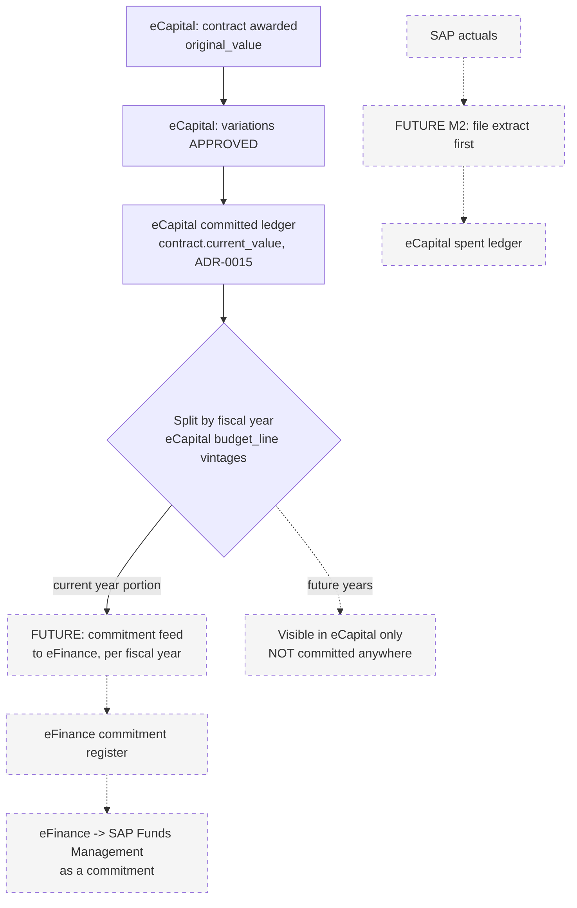

# eFinance, eMAP, eCapital: how the three systems fit together

**For:** whoever builds or operates any of the three (human or agent)
**From:** the eCapital deployment work, `/opt/ecapital` on `10.227.56.22`
**Language note:** English, because this is a technical spec, in the same
register as eFinance's own `INTEGRATION-eMAP.md`, which this document
follows as its model. Each application's own UI stays in its own language —
eFinance and eMAP in Greek, eCapital in Greek first and English second.

---

## 1. What each system is, in one paragraph

**eMAP** runs procurement: tenders, the suppliers who bid on them, the
contracts and purchase orders that result, and direct awards and renewals.
It is the record of *how ΟΚΥπΥ buys things* for anything that goes through a
tender.

**eFinance** runs the money side of buying things once a need is raised: the
requisition-to-approval chain with its four-eyes and segregation-of-duties
rules, the invoice pipeline from PDF to SAP file, and the budget position
that both of those check against, live. It answers *can we afford this, and
who agreed to it* — SAP does the arithmetic, eFinance does the control.

**eCapital** runs ΟΚΥπΥ's capital works: the register of capital projects
from idea to closure, the construction contracts awarded against them and
their variations, and — from M2 onward — the assets and maintenance work
those projects hand over into service. It is the record of *what is being
built or fixed, on which project, under which contract*.

**The rule that holds all three together:** each system owns its records;
the others link, they do not copy. eMAP owns tenders and POs, eFinance owns
requisitions and invoices, eCapital owns projects and construction
contracts. Nothing in this document changes that without a written decision
on both sides.

---

## 2. Shared vocabulary

All three systems, and SAP, describe organisational units and money along
axes that already line up — the work here is confirming the mapping, not
inventing one.

### Entity codes — eFinance's 13, eCapital's eleven org units

eFinance's 13 entity codes are the reference (`INTEGRATION-eMAP.md` §2).
`ecapital.org_unit.entity_code` carries the same strings, so a record in
either system can be joined on this column without a lookup table.

| Code | eFinance name | eCapital org unit | Status |
|---|---|---|---|
| `NGH` | Γενικό Νοσοκομείο Λευκωσίας | NGH | mapped |
| `LAR` | Γενικό Νοσοκομείο Λάρνακας | LAR | mapped |
| `PAP` | Γενικό Νοσοκομείο Πάφου | PAP | mapped |
| `LGH` | Γενικό Νοσοκομείο Λεμεσού | LGH | mapped |
| `TRD` | Νοσοκομείο Τροόδους | TRD | mapped |
| `ARC` | Νοσοκομείο Αρχιεπίσκοπος Μακάριος ΙΙΙ | ARC | mapped |
| `CHR` | Νοσοκομείο Πόλεως Χρυσοχούς | CHR | mapped |
| `FAM` | Γενικό Νοσοκομείο Αμμοχώστου | FAM | mapped |
| `AMB` | Διεύθυνση Ασθενοφόρων | Υπηρεσία Ασθενοφόρων | mapped |
| `MH` | Υπηρεσίες Ψυχικής Υγείας | ΔΥΨΥ | mapped |
| `HC` | Κέντρα Υγείας | ΠΦΥ (Πρωτοβάθμια Φροντίδα Υγείας) | **mapped, unconfirmed** — see §8 |
| `HQ` | Κεντρικά Γραφεία | — | **unmapped** — no eCapital org unit today |
| `CNS` | Κοινοτική Νοσηλευτική Υπηρεσία | — | **unmapped** — no eCapital org unit today |

Eleven of thirteen. `HC ↔ ΠΦΥ` is the one mapping this document is asserting
rather than one somebody confirmed — flagged in §8. `HQ` and `CNS` have no
capital-projects register today; if either starts running capital works,
adding the org unit is the fix, not renaming an existing one to fit.

> **Send codes, never names**, exactly as eFinance's own rule says. `NGH`,
> not `Γενικό Νοσοκομείο Λευκωσίας`.

### Budget code = SAP Commitment Item = eCapital `budgetArticle`

eFinance's "budget code" and SAP's "Commitment Item" are the same string
today (`INTEGRATION-eMAP.md` §2), and eCapital's `project.budget_article`
is meant to be the same axis for capital works. Right now the two sides
disagree in scale: eFinance has **203** active operational budget codes;
`project.budget_article` is constrained to exactly three values (`08021`,
`08022`, `08023`) — the capital-specific commitment items, presumably a
small subset of the 203, not a parallel list.

**Flag, not yet verified:** nobody has checked `08021`/`08022`/`08023`
against eFinance's 203 codes to confirm they are the same three strings
eFinance already carries, rather than three eCapital invented independently.
Do this on the **first Capex Plan import that reaches production** — it is
the first point real money figures actually land in both systems, and a
mismatch found there is a currency argument waiting to happen at year-end
reconciliation, not a rounding note.

### Fiscal year

Same concept, same calendar year, in all three systems and in SAP. No
translation needed.

---

## 3. Reference formats

Every reference format any of the three systems generates, and how a reader
tells one from another at a glance:

| Prefix | System | What it identifies |
|---|---|---|
| `TND-` | eMAP | Tender |
| `CON-` | eMAP | Contract |
| `PO-` | eMAP | Purchase order |
| `REQ-` | eMAP | Request |
| `R-` | eFinance | Requisition (`R-<ENTITY>-<BUDGETCODE>-<DDMMYY>-<NN>`; legacy `REQ-<ENTITY>-<DDMMYY>-<NN>` still accepted, never renumbered) |
| `BT-` | eFinance | Budget transfer document (`BT-<FISCALYEAR>-<5 digits>`) |
| `CAP-YYYY-NNNN` | eCapital | Construction contract, immutable, alongside the contract's own legal `contractNo` |
| `<UNIT>-YYYY-NNN` | eCapital | Capital project (ADR-0014) |

eCapital's two reference formats are never re-keyed or renumbered once
issued, for the same reason eMAP's `PO-` number has to arrive at eFinance
unchanged (`INTEGRATION-eMAP.md` §4): a reference that gets retyped by hand
at each hop is a reference that stops joining to anything.

### The routing rule eFinance needs — a request, not a change we make

eFinance's invoice screen already resolves `contract_ref` to a link
(`INTEGRATION-eMAP.md` §3): a `CON-` prefix goes to
`{emap_url}/contracts?q=<ref>`. `CAP-` needs the same treatment, pointed at
eCapital instead:

```
CON-  →  {emap_url}/contracts?q=<ref>        (existing)
CAP-  →  {ecapital_url}/contracts?q=<ref>    (needed)
```

`GET /contracts?q=<ref>` on eCapital's web app resolves a `CAP-` reference
the same way eMAP's `/contracts?q=` resolves a `CON-` one — that side is
built. What is needed on **eFinance's** side is one new setting
(`ecapital_url`, alongside its existing `emap_url`) and one condition on the
prefix before building the link. That is a request to the eFinance team,
not something this deployment can do from eCapital's side — mirroring
exactly how eMAP could not change eFinance's linking logic for its own
`CON-` prefix either.

---

## 4. What connects the three systems today, and what is asked for

### Live after this release

- **eCapital → eMAP.** eCapital's `EMAP_URL` setting drives a link-out
  wherever the UI points at the procurement side of a capital project — the
  tender stage of a project stays in eMAP end to end (CAPEX-01 §1: "a
  contract starts at award — the tender stage stays in e-Procurement"), so
  eCapital never holds tender data to link *to* a specific record, only a
  base URL to send someone who needs to look at the tender. Read-only,
  exactly like eFinance's link to eMAP: no shared database, no credentials,
  no dependency on eMAP's internal ids.

### Not yet built

- **eCapital → eFinance invoices — TODO, pending an eFinance query route.**
  `EFINANCE_URL` is configured and ready, but there is no route on
  eFinance's side today for eCapital to query "which invoices are linked to
  this contract" or "what is this project's spend so far in eFinance" — and
  eFinance's own invoice `contract_ref` is free text against `CON-`/`CAP-`
  refs, not a structured API. Until such a route exists, any link from
  eCapital to an eFinance invoice is, at most, a `q=` search link a human
  clicks, the same shape as the routing rule in §3, not a data integration.

### Requests to the other two systems

1. **To eFinance:** add the `CAP-` routing rule in §3 — one setting, one
   condition.
2. **To eFinance:** confirm whether `08021`/`08022`/`08023` (§2) are the
   same three commitment items it already carries, or need adding.
3. **To eMAP:** nothing new. eCapital reads it the same way eFinance does —
   a link-out, never a shared database.

---

## 5. Money flows

Two flows exist as *design*, not as anything wired up today. **Nothing
writes across these three systems as of this release.** Every arrow in the
diagram below marked dashed is a decision that has not been implemented;
the diagram exists to show the shape the flow is meant to take, once it is.



**Contract award → eCapital's own committed ledger (live today).** A
contract's `current_value` is `original_value + sum(APPROVED variations)`, a
stored, trigger-maintained column (ADR-0015) — this part is entirely
internal to eCapital and already works.

**eCapital → eFinance, a commitment feed per fiscal year (future, M2 or
later).** The multi-year rule eMAP already follows for eFinance
(`INTEGRATION-eMAP.md` §6, Flow 3) applies here identically: a capital
contract spanning several years must feed **only its current-year portion**
as a commitment; future years are visible in eCapital's own `budget_line`
vintages but must not commit against a budget year that has not arrived
yet. This is eFinance's rule, not eCapital's invention, and eCapital
inherits it rather than deciding it independently.

**eFinance → SAP Funds Management (future, outside eCapital's scope).**
Once a commitment reaches eFinance, what happens next is exactly the
eFinance/SAP relationship `INTEGRATION-eMAP.md` §6 Flow 3 already describes
— eCapital has no direct relationship with SAP and no stake in whether
posting is automatic or human-mediated.

**SAP actuals → eCapital's spent ledger (future, M2, file extract first).**
`apps/api/README.md` already says `spent` and `forecast` arrive with the SAP
ingestion in M2 and read back `null` until then. The first cut is a file
extract, matching eFinance's own SAP interaction style rather than a live
API from day one.

---

## 6. Identity

All three systems sign in against the same on-prem Active Directory,
`ihcis.local`. Beyond that, each keeps its own idea of a role:

- **eFinance** maps an AD login to one of its 12 local roles via its own
  users/roles tables, with AD-first login falling back to a local account
  when AD is down.
- **eMAP** has its own users/roles, independently of both.
- **eCapital** maps an AD group to a role through
  `ecapital.role_mapping` (AD group → role, optionally scoped to one org
  unit — ADR-0009, and see `docs/deploy/RUNBOOK-10.227.56.22.md` §5 for how
  that table is filled by hand today). A user in no mapped group gets no
  roles and sees nothing, in eCapital specifically — that says nothing
  about what the same person can do in eFinance or eMAP, because none of
  the three shares a role model with either of the others.

There is no single sign-on session shared between the three applications
today: signing into one does not sign you into another, even though the
credential check happens against the same directory.

---

## 7. Rules eCapital will not break

Mirroring eFinance's own §7 for eMAP, because the same failure modes apply
to any third system joining this pair:

1. **Send entity codes, not names.** Exact strings from §2.
2. **References are never mutated once issued.** `CAP-` contract refs and
   `<UNIT>-YYYY-NNN` project codes travel unchanged, the same discipline
   eMAP's `PO-` number is held to.
3. **Split multi-year contracts by fiscal year, and only the current year
   commits** — inherited from eFinance's own rule (§5), not decided here.
4. **Amounts in EUR, VAT handling explicit.** eCapital's contract and
   variation values need to say, as plainly as eFinance's invoices do,
   whether a figure is net or gross before it ever crosses into a shared
   figure with eFinance.
5. **No writes to eFinance's tables, ever**, from eCapital or from anything
   eCapital triggers — the same boundary eFinance holds against eMAP.
   Nothing in this deployment gives eCapital write access to eFinance's
   database, and none should be requested casually.

---

## 8. Open questions for the owner

1. **Is `HC ↔ ΠΦΥ` the right mapping?** §2 asserts it because both names
   plausibly mean "primary/community health care", but nobody has confirmed
   it against a source that ties the two codes together explicitly.
2. **Should `HQ` become an eCapital org unit?** Central Administration may
   run or commission capital works of its own; if so, it needs a unit, an
   `entity_code` of `HQ`, and everything else that comes with being a unit
   in the register.
3. **Does eFinance want to read eCapital's committed ledger?** §5's feed is
   drawn eCapital-to-eFinance because that is the direction the multi-year
   commitment rule requires; nothing here has asked whether eFinance's own
   budget dashboard would want to *show* eCapital's committed figures
   before that pipe exists, as an interim, manual reconciliation step.
4. **Who posts eCapital's commitments to SAP once the feed exists** — a
   human, the same as eFinance's budget transfers today, or something more
   automatic, the same open question eMAP's own PO flow has not settled
   either (`INTEGRATION-eMAP.md` §9)? Whatever eFinance decides for its own
   PO flow is the strongest signal for what eCapital's contracts should do,
   since the volume argument (few transfers vs. many POs/contracts) applies
   to both.

---

## 9. Where the authoritative documentation lives

This file is a summary, written from eCapital's side. The sources of truth:

- **This repo's ADRs** (`docs/adr/`) — in particular ADR-0009 (auth and
  `role_mapping`), ADR-0010 (row-level security), ADR-0014 (project codes),
  ADR-0015 (variations and the commitment ledger), ADR-0016 (the Capex Plan
  import) and ADR-0017 (the site log).
- **eFinance's own `CLAUDE.md`**, on the server at
  `/home/administrator/finance` — §7 for the budget model, §7β for what it
  already knows about eMAP, and its `INTEGRATION-eMAP.md`, which this
  document is modelled on.
- **eMAP's own on-server documentation**, at `/home/administrator/emap` —
  not read for this document; anything above attributed to eMAP comes by
  way of eFinance's own notes on it, and should be checked directly against
  eMAP's docs before being treated as settled.
